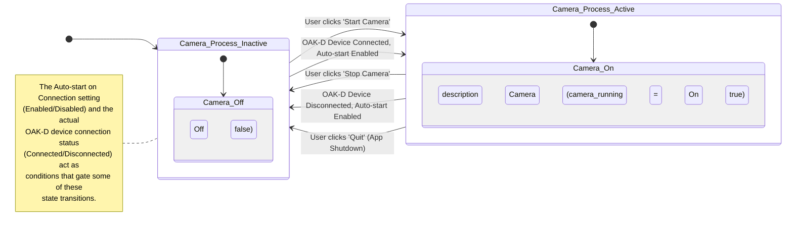

# OAK-D Lite Webcam Utility for Mac

## 概要

このプロジェクトは、Luxonis社のOAK-D LiteカメラをmacOS上で手軽に高性能なWebカメラとして利用するためのユーティリティです。
**基本的な使い方として、`src/uvc_handler.py` スクリプトを実行している間のみ、OAK-D LiteがWebカメラとして認識されます。**
その他、デバイスのブートローダーやアプリケーションパイプラインの書き換え、UVCデバイスとして初期化した後にスクリプトを終了する高度なオプションも提供します。
また、macOSのメニューバーからカメラ機能を制御するためのGUIアプリケーションも同梱しています。

## 主な機能

*   **一時的なWebカメラ化 (デフォルト)**: `src/uvc_handler.py` スクリプトを実行している間、OAK-D LiteのカラーカメラをUVC (USB Video Class) デバイスとして動作させ、Mac標準のWebカメラとして利用可能にします。これが本ユーティリティの主な使用方法です。
*   **パイプライン設定**: 4K解像度からのダウンスケールや720pなど、複数の解像度設定に対応したパイプラインを提供します。
*   **デバイスへの書き込み (高度なオプション)**:
    *   ブートローダーの書き換え (`-fb` オプション)
    *   アプリケーションパイプラインの書き換え (`-f` オプション)
*   **スタンドアロン動作 (高度なオプション)**: UVC初期化後にスクリプトを終了し、デバイス単体でWebカメラとして動作させる機能 (`-l` オプション) を提供します。

## `src/uvc_handler.py` の詳細

`src/uvc_handler.py` は、OAK-D LiteをUVCデバイスとして制御するためのコアスクリプトです。
**コマンドライン引数なしで実行するのが標準的な使用方法で、スクリプト実行中のみWebカメラとして機能します。**
その他、特定の目的のための高度なコマンドライン引数も用意されています。

### コマンドラインオプション

*   **引数なし (デフォルト)**:
    *   スクリプトを実行すると、接続されているOAK-D Liteが一時的にUVCデバイスとして動作します。スクリプト実行中のみWebカメラとして利用可能です。これが最も一般的な使用方法です。

以下のオプションは、特定の高度な操作を行うためのものです。

*   **`-fb` または `--flash-bootloader`**:
    *   OAK-D Liteデバイスのブートローダーを書き換えます。
    *   **使用ケース**: Luxonisから新しいブートローダーが提供された場合や、ブートローダーの破損が疑われる場合。
    *   **注意点**: デバイスの動作に深刻な影響を与える可能性があるため、慎重に実行してください。書き換え後はデバイスの電源を再投入する必要があります。

*   **`-f` または `--flash-app`**:
    *   スクリプト内の `getMinimalPipeline()` で定義されたUVCカメラ設定（アプリケーションパイプライン）をデバイスのフラッシュメモリに書き込みます。
    *   **使用ケース**: OAK-D LiteをPC接続時に常に特定のWebカメラ設定で永続的に使用したい場合。
    *   **注意点**: 既存のアプリケーションパイプラインは上書きされます。書き換え後はデバイスの電源を再投入する必要があります。

*   **`-l` または `--load-and-exit`**:
    *   OAK-D LiteをUVCデバイスとして初期化した後、スクリプトを終了します。デバイスのウォッチドッグタイマーが無効化され、ホストPCからの通信なしに動作し続けます。
    *   **使用ケース**: スクリプトを常駐させずにWebカメラ機能を利用したいが、デバイス設定を永続化したくない場合。
    *   **注意点**: 再度DepthAIライブラリ経由でデバイスに接続する場合、電源の再投入が必要になることがあります。
*   **`--start-uvc`**:
    *   UVCカメラモードを起動します。このオプションは主に `src/menu_bar_app.py` から内部的に使用されることを想定しています。
    *   コマンドラインから直接このオプションを使用することも可能ですが、その場合はCtrl+Cでプロセスを終了する必要があります。


### 主要な関数

*   **`getMinimalPipeline()`**:
    *   1080p解像度、NV12フォーマットの基本的なUVCパイプラインを構築して返します。FPSは30に設定されます。
    *   カメラ名は "MinimalUVCCam\_1080p" となります。

*   **`getPipeline()`**:
    *   より高度な設定が可能なUVCパイプラインを構築します。
    *   `enable_4k` フラグにより、4K解像度から1080pへのダウンスケール、または720p解像度を選択できます。
    *   カメラ名は "FlashedCam\_1080p\_NV12" となります。

*   **`flash(pipeline=None)`**:
    *   デバイスのブートローダーまたは指定されたパイプラインをフラッシュメモリに書き込みます。
    *   `pipeline`引数が `None` の場合はブートローダーを、パイプラインオブジェクトが渡された場合はそのパイプラインを書き込みます。
    *   書き込みの進捗状況を表示します。

*   **`handle_flash_bootloader()`**:
    *   `-fb` オプションが指定された場合に呼び出され、`flash()` 関数を使ってブートローダーを書き込みます。

*   **`handle_flash_app()`**:
    *   `-f` オプションが指定された場合に呼び出され、`flash(getMinimalPipeline)` を実行して、`getMinimalPipeline` で定義された設定をデバイスに書き込みます。

*   **`handle_load_and_exit()`**:
    *   `-l` オプションが指定された場合に呼び出されます。
    *   環境変数 `DEPTHAI_WATCHDOG` を "0" に設定してウォッチドッグを無効化します。
    *   `getPipeline()` で定義されたパイプラインでデバイスを初期化し、その後スクリプトプロセスを終了させます。

*   **`run_uvc_device()`**:
    *   コマンドライン引数なし、または `--start-uvc` オプションでスクリプトが実行された場合に呼び出されます。
    *   `getMinimalPipeline()` で定義されたパイプラインを使用してデバイスをUVCモードで起動し、スクリプトが実行されている間、Webカメラとして機能させます。Ctrl+Cで終了します。

*   **`main()`**:
    *   コマンドライン引数を解析し、対応するハンドラ関数（`handle_flash_bootloader`, `handle_flash_app`, `handle_load_and_exit`）または `run_uvc_device()` (`--start-uvc` や引数なしの場合) を呼び出します。
    *   `-fb` と `-f` オプションの同時指定はエラーとして扱います。

## macOS Menu Bar Application (`src/menu_bar_app.py`)

このプロジェクトには、macOSのメニューバーからOAK-D LiteのWebカメラ機能を制御するためのGUIアプリケーションが含まれています。

### 実行方法

以下のコマンドでメニューバーアプリケーションを起動します:
```bash
python src/menu_bar_app.py
```
**注意**: このアプリケーションはmacOS専用であり、`rumps` ライブラリに依存しています。事前に `pip install -r requirements.txt` で `rumps` をインストールしておく必要があります。

### 主な機能

*   **カメラの開始/停止**: メニューバーのアイコンから「Start Camera」または「Stop Camera」を選択することで、Webカメラ機能を有効化/無効化できます。
*   **デバイス接続監視と自動起動**:
    *   OAK-D LiteのUSB接続状態を監視します。
    *   「Auto-start on Connection」メニュー項目をオンにすると、デバイス接続時にカメラが自動的に起動し、切断時に自動的に停止します。
*   **アプリケーションの終了**: メニューバーから「Quit」を選択してアプリケーションを安全に終了できます。カメラが動作中の場合は自動的に停止されます。
*   **通知**: カメラの開始/停止時、デバイスの接続/切断時、自動起動設定の変更時、またはエラー発生時にmacOSの通知センターを通じてフィードバックが表示されます。

このメニューバーアプリケーションは、`src/uvc_handler.py` スクリプトをサブプロセスとして起動・停止することでカメラを制御します。また、`depthai` ライブラリを使用してUSBデバイスの接続状態を監視します。これにより、カメラ制御ロジックとGUIアプリケーションが分離され、安定性が向上しています。

### 状態遷移 (メニューバーアプリケーション)

メニューバーアプリケーションにおけるカメラプロセスの主な状態と遷移は以下の通りです。



**図の説明:**

*   **`Camera_Process_Inactive`**: カメラプロセスが動作していない状態です (`camera_running`が`false`)。アプリケーション起動時の初期状態です。
*   **`Camera_Process_Active`**: カメラプロセスが動作している状態です (`camera_running`が`true`)。

**主な遷移:**

*   **`Camera_Process_Inactive` から `Camera_Process_Active` へ:**
    *   ユーザーがメニューから「Start Camera」をクリックする。
    *   OAK-DデバイスがUSB接続され、かつ「Auto-start on Connection」メニューが有効になっている場合。
*   **`Camera_Process_Active` から `Camera_Process_Inactive` へ:**
    *   ユーザーがメニューから「Stop Camera」をクリックする。
    *   OAK-DデバイスがUSB切断され、かつ「Auto-start on Connection」メニューが有効になっている場合。
    *   ユーザーがアプリケーションを「Quit」する。

## システム構成 (参考)

(このセクションは元のREADMEから流用・調整可能です。プロジェクトの進捗に合わせて更新してください。)

## 技術要素

*   **プログラミング言語**: Python 3.x
*   **主要ライブラリ**:
    *   `depthai`: OAK-D Liteの制御、UVC (USB Video Class) 化機能の利用。
    *   標準ライブラリ: `time`, `argparse`, `os`, `signal`, `subprocess` など。


## セットアップ (開発者向け)

1.  **開発環境のセットアップ**:
    *   Python 3.8以上を推奨。
    *   仮想環境の利用を推奨します。
    *   必要なライブラリをインストール:
        ```bash
        pip install -r requirements.txt
        ```
        (`requirements.txt` には `depthai`, `rumps` などを記載)

2.  **実行可能ファイルのビルド (PyInstaller)**:
    *   このプロジェクトでは、`src/uvc_handler.py` を単一の実行可能ファイルとしてビルドするためのスクリプトを提供しています。
    *   **ビルドに必要なもの**:
        *   PyInstaller: まだインストールしていない場合は、以下のコマンドでインストールしてください。
            ```bash
            pip install pyinstaller
            ```
    *   **`uvc_runner` のビルド (単一実行ファイル)**:
        *   `src/uvc_handler.py` を `uvc_runner` という名前の単一実行ファイルとしてビルドするには、プロジェクトのルートディレクトリで以下のコマンドを実行します。
            ```bash
            bash build_scripts/build_uvc_runner.sh
            ```
        *   ビルドが成功すると、プロジェクトルート直下の `dist/` ディレクトリ内に `uvc_runner` が作成されます。
        *   このプロセス中に、`build_scripts/` ディレクトリに `uvc_runner.spec` という設定ファイルが、プロジェクトルート直下の `build/` ディレクトリに一時的な作業ファイルが生成されます。
        *   **`.spec` ファイルについて**: このファイルはPyInstallerがビルド設定を管理するために使用します。通常は自動生成された内容で十分ですが、依存関係の追加、除外するモジュールの指定、隠しインポートの解決など、より詳細なビルドのカスタマイズが必要な場合に手動で編集することができます。
        *   ビルドされた `uvc_runner` は、`python src/uvc_handler.py` と同様にコマンドライン引数を受け付けます。例えば、`./dist/uvc_runner -l` のように実行できます。

    *   **`OakWebcamApp.app` のビルド (macOSアプリケーションバンドル)**:
        *   `src/menu_bar_app.py` を `OakWebcamApp.app` というmacOSアプリケーションバンドルとしてビルドするには、プロジェクトのルートディレクトリで以下のコマンドを実行します。
            ```bash
            bash build_scripts/build_app.sh
            ```
        *   このスクリプトは、まず内部的に `build_scripts/build_uvc_runner.sh` を実行して `uvc_runner` をビルドします。
        *   次に、PyInstallerを使用して `OakWebcamApp.app` を作成します。この際、事前にビルドされた `uvc_runner` と、`src/uvc_handler.py` スクリプト自体もアプリケーションバンドル内に同梱されます。
        *   ビルドプロセス中に `OakWebcamApp.spec` のような `.spec` ファイルが生成され、これも必要に応じてカスタマイズ可能です。
        *   ビルドが成功すると、`OakWebcamApp.app` はPyInstallerによって一時的に `dist/` ディレクトリに作成された後、最終的に `build_scripts/app/` ディレクトリに移動されます。

3.  **スクリプトの直接実行**:
    *   **基本的なUVCデバイスとしての実行 (推奨される主な使用方法)**:
        ```bash
        python src/uvc_handler.py
        ```
        このコマンドでスクリプトを実行すると、スクリプトが動作している間のみOAK-D LiteがWebカメラとして利用可能になります。

    *   **高度なオプション (`uvc_handler.py` 直接実行時)**:
        *   アプリケーションパイプラインの書き込み (設定をデバイスに永続化):
            ```bash
            python src/uvc_handler.py -f
            ```
        *   ブートローダーの書き込み (特殊なメンテナンス用途):
            ```bash
            python src/uvc_handler.py -fb
            ```
        *   UVC初期化後にスクリプト終了 (デバイス単体で動作、設定は非永続):
            ```bash
            python src/uvc_handler.py -l
            ```

## 注意点・既知の問題

*   **`depthai` のバージョン**: UVC機能は比較的新しい機能のため、`depthai` のバージョンによって動作が異なる場合があります。`requirements.txt` で指定されたバージョンを使用することを推奨します。
*   **デバイスの認識**: スクリプト実行前にOAK-D LiteがPCに正しく接続され、認識されていることを確認してください。
*   **フラッシュ書き込み**: ブートローダーやアプリケーションパイプラインの書き込みは、デバイスの動作に影響を与える可能性があるため、慎重に行ってください。書き込み後は、指示に従いデバイスの電源を再投入してください。
*   **カメラ起動中の物理的な切断**: カメラが起動している最中にOAK-D LiteのUSBケーブルを物理的に抜いた場合、アプリケーションがカメラの停止を自動的に検知できないことがあります。この場合、メニューから手動でカメラを停止するか、アプリケーションを再起動する必要がある場合があります。この挙動は現在のバージョンではサポート外となります。

## 今後の改善点 (TODO)

*   [x] `PyInstaller` を用いたスタンドアロンアプリケーション化 (`uvc_handler.py` のみ、ビルドスクリプト `build_scripts/build_uvc_runner.sh` を提供)。
*   [ ] `launchd` サービスによる自動起動設定。
*   [ ] より詳細なエラーハンドリングとユーザーフレンドリーなフィードバック。
*   [ ] GUI設定画面の追加 (カメラ解像度/FPS選択など)。

## ライセンス

このプロジェクトは MIT License のもとで公開されます。詳細は `LICENSE` ファイルを参照してください。
