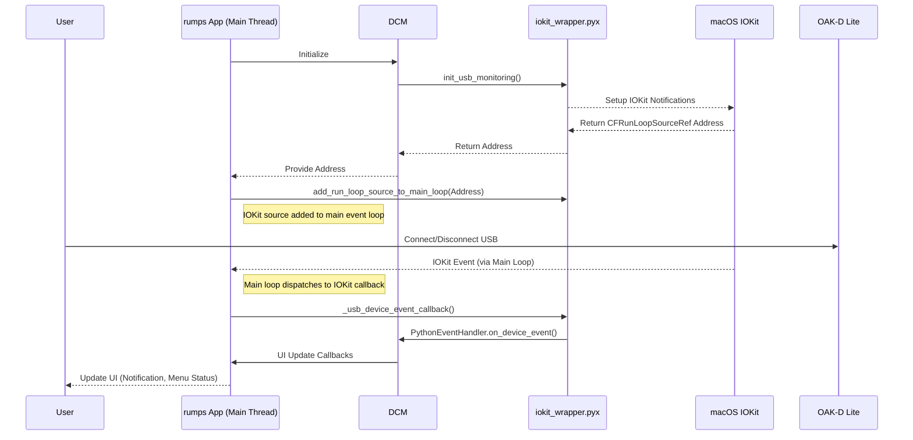

# OAK-D Lite Webcam Utility for Mac

[](LICENSE)
[](https://www.python.org/)
[](https://www.apple.com/macos)

This document is also available in [Japanese](./README_JP.md).

OAK-D Lite Webcam Utility for Mac is a utility software designed to easily use Luxonis's OAK-D Lite camera as a high-performance webcam on macOS.

This utility allows you to leverage the powerful image processing capabilities of the OAK-D Lite to use high-quality video as a Mac webcam in various applications (video conferencing, live streaming, etc.).

## 🌟 Key Features

*   **Easy Webcam Conversion**: Simply connect your OAK-D Lite and run the bundled menu bar app or command-line script to start using it as a webcam without any special configuration.
*   **Simple Menu Bar Operation**: Intuitively control webcam start/stop, auto-start settings, etc., from the app icon résident in the macOS menu bar.
*   **Automatic Control on Device Connection/Disconnection**: Detects USB connection/disconnection of the OAK-D Lite and can automatically start or stop the webcam function.
*   **Stable Operation**: Manages the `uvc_handler.py` script as a subprocess, separating the GUI application from the camera control logic for stable performance.
*   **Efficient USB Device Detection (macOS)**: Leverages macOS's native IOKit framework via a Cython wrapper (`src/iokit_wrapper.pyx`) for highly efficient, event-driven USB device detection (specifically for OAK-D Lite). This approach integrates IOKit event sources directly into the main application event loop, ensuring low CPU usage, immediate response to device connection/disconnection, and enhanced stability compared to polling methods.
*   **Flexible Pipeline Configuration (Advanced)**: In addition to the default 1080p setting, pipelines対応した to multiple resolution settings, such as downscaling from 4K or 720p, are available (currently requires script editing for customization).
*   **Device Flashing (Advanced)**:
    *   Write specific webcam settings (application pipeline) to the OAK-D Lite's flash memory for persistence.
    *   Provides a bootloader flashing feature for maintenance purposes.
*   **Standalone Operation (Advanced)**: Allows the script to exit after UVC initialization, enabling the device to operate as a webcam fatores.

## 💻 System Requirements

*   **OS**: macOS Catalina (10.15) or later
*   **Hardware**:
    *   Luxonis OAK-D Lite camera
    *   USB 3.0 Type-C port (for OAK-D Lite connection)
*   **Software**: Python 3.8 or later

## 🚀 Installation and Launch

### 1. Clone the Repository

First, clone this repository to your local machine:
```bash
git clone https://github.com/usaganikki/OAK-DLiteWebcamUtilityForMac.git
cd OAK-DLiteWebcamUtilityForMac
```

### 2. Install Dependencies

Install the required Python libraries. Using a virtual environment is recommended.
```bash
python3 -m venv venv
source venv/bin/activate  # macOS / Linux
# venv\Scripts\activate  # Windows (for reference)

pip install -r requirements.txt
```
`requirements.txt` includes `depthai` (core library) for OAK-D Lite control, `depthai-sdk` (provides additional features), `rumps` (GUI control) for the menu bar app, `pyinstaller` for application bundling, and other necessary libraries.
It also includes `Cython` and `setuptools` which are required for building the IOKit wrapper.

### 3. Build the Cython IOKit Wrapper (macOS only)

The application uses a Cython module for native IOKit USB event monitoring on macOS. This module needs to be compiled first.
In the project root directory, run:
```bash
python3 setup.py build_ext --inplace
```
This command compiles `src/iokit_wrapper.pyx` and places the resulting `.so` file in the `src` directory.

### 4. Launch the Menu Bar Application (Recommended)

After building the Cython module, launch the menu bar application with the following command:
```bash
python3 -m src.menu_bar_app
```
When launched, the application will appear in the macOS menu bar as "OAK-D UVC" (or "OAK-D" when hovering over the icon), displaying the OAK-D Lite icon.
Click this icon to control the camera and change settings.
If the OAK-D Lite is already connected when the application starts and "Enable Auto Camera Control" is on (default), the camera will start automatically.

**Note on First Launch:**
macOS security settings may block the application from running. If this happens, go to "System Preferences" > "Security & Privacy" > "General" tab and allow the application to run.

### 5. Direct Execution from Command Line (Advanced Operations/Debugging)

You can also run the `src/uvc_handler.py` script directly:
```bash
python3 src/uvc_handler.py
```
With this method, the OAK-D Lite will function as a webcam only while the script is running.
Refer to the "`src/uvc_handler.py` Details" section below for more information.
(Note: Direct execution of `uvc_handler.py` does not use the IOKit-based device monitoring.)

## 👇 Usage

### Menu Bar Application

1.  **Launch**: Start the menu bar application as described in the "Installation and Launch" section. The application icon, labeled "OAK-D UVC" (or showing "OAK-D" as a tooltip), will appear in the menu bar.
2.  **Camera Control**:
    *   **Enable/Disable Auto Control**: Select "Enable Auto Camera Control" from the menu to enable (checked) or disable (unchecked) automatic camera start/stop based on OAK-D Lite's USB connection status. Enabled by default.
        *   When enabled: The camera starts automatically when the device is connected and stops when disconnected.
        *   When disabled: The camera will not start/stop automatically regardless of the device's connection status.
    *   **Manual Camera Stop (Disconnect)**: Select "Disconnect Camera" from the menu to stop the currently running camera. This action may temporarily disable "Enable Auto Camera Control" (it can be re-enabled).
    *   **Starting the Camera**: There is no explicit "Start Camera" menu item. To start the camera, connect the OAK-D Lite while "Enable Auto Camera Control" is active, or enable "Enable Auto Camera Control" if the device is already connected.
    *   Notifications: Feedback on camera status changes and setting modifications will be displayed through the macOS Notification Center.
3.  **Quit Application**: Select "Quit" to close the application. If the camera is running, it will be stopped automatically.

### Using as a Webcam

Once the camera is started, the OAK-D Lite will be recognized as a standard webcam on your Mac.
You can select it in most applications that use a webcam, such as Zoom, Google Meet, OBS Studio, QuickTime Player, etc. It will typically appear under a name like "OAK-D Lite UVC Camera."

## 🛠️ `src/uvc_handler.py` Details (Command Line)

`src/uvc_handler.py` is the core script for controlling the OAK-D Lite as a UVC device.
The menu bar application internally calls this script to manage the camera.
Developers or users who want to perform advanced operations can use this script directly from the command line.

**Basic Usage (Temporary Webcam Mode):**
```bash
python src/uvc_handler.py
```
Running this command will make the OAK-D Lite available as a webcam only as long as the script is running. Exiting the script (Ctrl+C) will stop the webcam function.

### Command Line Options

The following options are for specific advanced operations:

*   **`-fb` or `--flash-bootloader`**:
    *   Flashes the bootloader of the OAK-D Lite device.
    *   **Use Case**: When a new bootloader is provided by Luxonis, or if bootloader corruption is suspected.
    *   **Caution**: Execute with care as it can severely affect device operation. A power cycle is required after flashing.

*   **`-f` or `--flash-app`**:
    *   Writes the UVC camera settings (application pipeline) defined in `getMinimalPipeline()` within the script to the device's flash memory.
    *   **Use Case**: If you want the OAK-D Lite to permanently use specific webcam settings when connected to a PC.
    *   **Caution**: Overwrites the existing application pipeline. A power cycle is required after flashing.

*   **`-l` or `--load-and-exit`**:
    *   Initializes the OAK-D Lite as a UVC device and then exits the script. The device's watchdog timer is disabled, allowing it to continue operating without communication from the host PC.
    *   **Use Case**: If you want to use the webcam function without keeping the script running, but do not want to persist settings to the device.
    *   **Caution**: A power cycle may be required to reconnect to the device via the DepthAI library.

*   **`--start-uvc`**:
    *   Starts UVC camera mode. This option is primarily intended for internal use by `src/menu_bar_app.py`.
    *   It can also be used directly from the command line, but the process must then be terminated with Ctrl+C.

### Key Functions (uvc_handler.py)

*   **`getMinimalPipeline()`**: Constructs a basic UVC pipeline with 1080p resolution, NV12 format, and 30 FPS. Camera name is "MinimalUVCCam\_1080p".
*   **`getPipeline()`**: Constructs a more advanced UVC pipeline. Currently returns a pipeline that downscales from 4K resolution to 1080p (the `enable_4k` flag is fixed to `True` in the code). Camera name is "FlashedCam\_1080p\_NV12".
*   **`flash(pipeline=None)`**: Flashes the bootloader or a specified pipeline to the device's flash memory.
*   **`handle_flash_bootloader()`**: Handles the `-fb` option.
*   **`handle_flash_app()`**: Handles the `-f` option.
*   **`handle_load_and_exit()`**: Handles the `-l` option.
*   **`run_uvc_device()`**: Handles UVC mode activation when no arguments or the `--start-uvc` option is provided.
*   **`main()`**: Parses command-line arguments and calls the corresponding handler functions.

## ⚙️ For Developers

### Project Structure

```
OAK-DLiteWebcamUtilityForMac/
├── .github/                    # GitHub related files (Issue templates, etc.)
│   └── ISSUE_TEMPLATE/
│       ├── bug_report.md
│       └── feature_request.md
├── build_scripts/              # Build scripts directory
│   ├── build_app.sh            # Script to build macOS .app bundle
│   ├── build_uvc_runner.sh     # Script to build uvc_handler.py standalone executable
│   └── app/                    # Final destination for the .app bundle (after build)
├── dist/                       # PyInstaller build output directory (after build)
├── doc/                        # Documentation
│   ├── development_roadmap.md  # Development roadmap
│   └── uvc_handler_description.md # Detailed description of uvc_handler.py (Older, main content merged to README. Consider archiving/deleting)
├── src/                        # Source code
│   ├── menu_bar_app.py         # macOS menu bar application
│   ├── uvc_handler.py          # OAK-D Lite UVC control core script
│   ├── device_connection_manager.py # Device connection/disconnection monitoring class
│   └── iokit_wrapper.pyx       # Cython wrapper for IOKit framework (macOS USB events)
├── .gitignore
├── LICENSE                     # MIT License file
├── README.md                   # This file (English)
├── README_JP.md                # Japanese version of README
└── requirements.txt            # Python dependency list
```

### Setup

1.  **Development Environment**:
    *   Python 3.8 or higher is recommended.
    *   Using a virtual environment (e.g., `venv`) is strongly recommended.
2.  **Install Dependencies**:
    ```bash
    pip install -r requirements.txt
    ```
    For development, consider installing additional libraries for debugging and type checking (e.g., `pylint`, `mypy`).

### Build Instructions

The application consists of a Python-based menu bar app and a Cython module for IOKit integration.

#### 1. Build the Cython IOKit Wrapper (macOS only)
As mentioned in the "Installation and Launch" section, the Cython module must be built first:
```bash
python3 setup.py build_ext --inplace
```
This creates `iokit_wrapper.cpython-*.so` in the `src` directory.

#### 2. Build `uvc_runner` (Standalone Executable for Camera Control)

Builds `src/uvc_handler.py` into a single executable named `uvc_runner`.
This executable is used internally by the menu bar application (`OakWebcamApp.app`).

Run the following command in the project root directory:
```bash
bash build_scripts/build_uvc_runner.sh
```
Upon successful build, `uvc_runner` will be created in the `dist/` directory.
Build settings can be customized in `build_scripts/uvc_runner.spec` (may be generated on first build or created manually).

#### 2. Build `OakWebcamApp.app` (macOS Application Bundle)

Builds `src/menu_bar_app.py` into a macOS application bundle named `OakWebcamApp.app`.

Run the following command in the project root directory:
```bash
bash build_scripts/build_app.sh
```
This script performs the following:
1.  Internally runs `build_scripts/build_uvc_runner.sh` to build the latest `uvc_runner`.
2.  Uses `PyInstaller` to create `OakWebcamApp.app`. The built `uvc_runner` and the `src/uvc_handler.py` script itself are included in the bundle.
3.  The app icon (`assets/app_icon.icns` - **TODO: To be created in Issue #8**) will be applied (currently commented out in the build script).
Upon successful build, `OakWebcamApp.app` is created in the `dist/` directory and then moved to the `build_scripts/app/` directory.
Build settings can be customized in `build_scripts/OakWebcamApp.spec` (may be generated on first build or created manually).

### IOKit-based USB Event Monitoring (macOS)

To provide responsive and efficient USB device detection, this utility employs a custom IOKit integration on macOS. Here's a brief overview of how it works:

1.  **Cython Wrapper (`src/iokit_wrapper.pyx`)**:
    *   This module directly calls C APIs from macOS's IOKit and CoreFoundation frameworks.
    *   It sets up notifications for USB device matching (connection) and termination (disconnection) events specifically for the OAK-D Lite (based on Vendor ID and Product ID).
    *   When an IOKit notification occurs, a C callback function within the Cython module is triggered.
    *   Instead of running a separate event loop thread (which can cause instability with GUI apps), `init_usb_monitoring` now creates an `IONotificationPortRef` and derives a `CFRunLoopSourceRef` from it. The address of this `CFRunLoopSourceRef` is returned to the Python side.

2.  **Device Connection Manager (`src/device_connection_manager.py`)**:
    *   Initializes the `iokit_wrapper` and obtains the `CFRunLoopSourceRef` address.
    *   It no longer manages a separate thread for IOKit events.

3.  **Menu Bar App (`src/menu_bar_app.py`)**:
    *   Retrieves the `CFRunLoopSourceRef` address from the `DeviceConnectionManager`.
    *   Uses a helper function in `iokit_wrapper.pyx` (`add_run_loop_source_to_main_loop`) to add this IOKit event source to the main application's `CFRunLoop` (obtained via `CFRunLoopGetMain()`).
    *   This integrates IOKit event processing directly into the `rumps` (AppKit) main event loop.
    *   When the application quits, another helper (`remove_run_loop_source_from_main_loop`) is called to remove the source, and `iokit_wrapper.stop_usb_monitoring()` cleans up IOKit resources.

4.  **Event Handling Flow**:
    *   When a USB device is connected or disconnected, IOKit sends a notification.
    *   The main application run loop, now monitoring the IOKit `CFRunLoopSourceRef`, picks up this event.
    *   The C callback in `iokit_wrapper.pyx` (`_usb_device_event_callback`) is executed on the main thread.
    *   This callback, after acquiring the Python GIL, calls the appropriate Python handler method in `USBEventHandler` (e.g., `on_device_connected`).
    *   The Python handler then updates the application state and UI through callbacks to `MenuBarApp`.

This approach ensures that all IOKit event handling and subsequent Python logic occur within the context of the main application thread, improving stability and responsiveness.

**Simplified Event Flow Diagram:**



### Coding Conventions & Contributions

*   **Coding Style**: Adhere to [PEP 8](https://www.python.org/dev/peps/pep-0008/). Using linters/formatters like `flake8` or `black` is recommended.
*   **Type Hints**: Use type hints 적극적으로 for readability and maintainability. Type checking with `mypy` is recommended.
*   **Commit Messages**: Follow the Conventional Commits format ([https://www.conventionalcommits.org/](https://www.conventionalcommits.org/)).
    Examples: `feat: Add new feature`, `fix: Correct a bug`, `docs: Update documentation`, `refactor: Code refactoring`
*   **Branching Strategy**:
    *   `main`: Stable branch. Avoid direct commits; merge via Pull Requests.
    *   `develop`: Development branch. New features and bug fixes should be based on this branch.
    *   Feature branches: `feat/feature-name` (e.g., `feat/gui-settings`)
    *   Bugfix branches: `fix/issue-number` or `fix/short-description` (e.g., `fix/123` or `fix/camera-disconnect`)
*   **Pull Requests**:
    *   Target the `develop` branch.
    *   Clearly describe changes, reasons, and test results.
    *   Conduct a self-review if possible.

### Testing

Currently, an automated testing framework is not implemented.
Manual operational checks are the primary testing method.
Introducing unit and integration tests is a future improvement.

## ⚠️ Caveats & Known Issues

*   **`depthai` Version**: UVC functionality is relatively new, so behavior may vary with `depthai` versions. Using the version specified in `requirements.txt` is strongly recommended.
*   **Device Recognition**: Ensure the OAK-D Lite is properly connected to the Mac via USB and recognized by the system before running scripts or the application.
*   **Flashing Risks**: Writing to the flash memory (bootloader or application pipeline) can seriously affect device operation. Incorrect operations could potentially brick the device, so proceed with caution and a full understanding of the actions. Power cycle the device as instructed after flashing.
*   **Physical Disconnection While Camera is Active**: If the OAK-D Lite's USB cable is physically unplugged while the camera is active, the menu bar application may not automatically detect/handle the camera process stopping. In this case, you may need to manually select "Stop Camera" (or "Disconnect Camera") from the menu or restart the application.
*   **Resource Conflicts**: The utility may not function correctly if another application is using the OAK-D Lite.
*   **macOS Security**: On first launch or after updates, macOS security features (like Gatekeeper) might block the application. If so, allow execution in "System Preferences" > "Security & Privacy".

## ❓ FAQ (Frequently Asked Questions)

*   **Q1: Camera is not recognized.**
    *   A1: Check if the OAK-D Lite is correctly connected to your Mac via USB. If using a USB hub, try connecting directly to a USB port on the Mac. Also, verify that the `depthai` library is installed correctly and matches the version in `requirements.txt`.
*   **Q2: Menu bar icon does not appear.**
    *   A2: Ensure the `python src/menu_bar_app.py` command runs without errors. Check if the `rumps` library is installed correctly.
*   **Q3: "Auto-start on Connection" (Enable Auto Camera Control) doesn't work.**
    *   A3: Verify that OAK-D Lite connection/disconnection is being detected correctly. Rarely, macOS might delay USB device event notifications.
*   **Q4: When should I use the advanced options (`-f`, `-fb`, `-l`)?**
    *   A4: These options are for special purposes and not needed for regular webcam use. Use them only if you have a clear reason, such as updating device firmware, persisting specific settings, or temporarily running the device without a script, and understand the implications.

## 🛣️ Future Improvements (Excerpt from Roadmap)

*   **Issue #8: Create and apply application icon**
*   **Issue #7: `launchd` service for automatic startup** (more OS-native auto-start)
*   **Issue #13: Detailed error handling and user-friendly feedback**
*   **Issue #14: Add GUI settings screen** (camera resolution/FPS selection, etc.)
*   **Issue #11: More robust USB event monitoring** (consider IOKit)
*   **Issue #15: Application code signing and notarization** (enhanced Gatekeeper compatibility)
*   **Issue #12: Dynamic generation and management of `launchd` plist** (in-app auto-start settings)
*   **Issue #16: Multilingual support**

Refer to the [Development Roadmap (`doc/development_roadmap.md`)](doc/development_roadmap.md) for details.

## 📜 License

This project is released under the [MIT License](LICENSE).

## 🙏 Acknowledgements

*   [Luxonis](https://www.luxonis.com/) and the DepthAI team: For providing the OAK cameras and the powerful SDK.
*   [rumps](https://github.com/jaredks/rumps): A great library for easily creating macOS menu bar apps.

---

Feel free to submit feedback, bug reports, and feature requests via GitHub Issues!
Contributions are also welcome.
