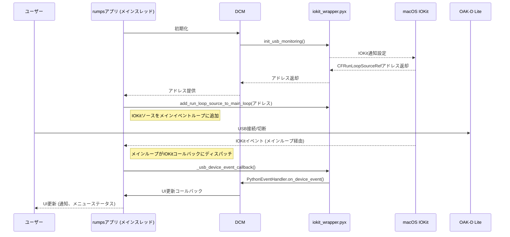

# OAK-D Lite Webcam Utility for Mac

[](LICENSE)
[](https://www.python.org/)
[](https://www.apple.com/macos)

OAK-D Lite Webcam Utility for Macは、Luxonis社のOAK-D LiteカメラをmacOS上で手軽に高性能なWebカメラとして利用するためのユーティリティソフトウェアです。

このユーティリティを使用すると、OAK-D Liteの強力な画像処理能力を活かし、高品質な映像をMacのWebカメラとして様々なアプリケーション（ビデオ会議、ライブ配信など）で利用できます。

## 🌟 主な機能

*   **簡単なWebカメラ化**: OAK-D Liteを接続し、同梱のメニューバーアプリまたはコマンドラインスクリプトを実行するだけで、特別な設定なしにWebカメラとして利用開始できます。
*   **メニューバーからの簡単操作**: macOSのメニューバーに常駐するアプリアイコンから、Webカメラの開始・停止、自動起動設定などを直感的に操作できます。
*   **デバイス接続/切断時の自動制御**: OAK-D LiteのUSB接続・切断を検知し、Webカメラ機能を自動的に開始または停止する設定が可能です。
*   **安定した動作**: `uvc_handler.py` スクリプトをサブプロセスとして管理することで、GUIアプリケーションとカメラ制御ロジックを分離し、安定した動作を実現しています。
*   **効率的なUSBデバイス検出 (macOS)**: Cythonラッパー (`src/iokit_wrapper.pyx`) を介してmacOSネイティブのIOKitフレームワークを活用し、OAK-D Lite専用の非常に効率的なイベント駆動型USBデバイス検出を実現しています。このアプローチは、IOKitイベントソースをメインアプリケーションのイベントループに直接統合することで、低CPU使用率、デバイス接続/切断への即時応答、およびポーリング方式と比較して強化された安定性を保証します。
*   **柔軟なパイプライン設定 (高度)**: デフォルトの1080p設定に加え、4K解像度からのダウンスケールや720pなど、複数の解像度設定に対応したパイプラインを利用可能です（現在はスクリプト編集によるカスタマイズが必要）。
*   **デバイスへの設定書き込み (高度)**:
    *   特定のWebカメラ設定（アプリケーションパイプライン）をOAK-D Liteのフラッシュメモリに書き込み、永続化できます。
    *   ブートローダーの書き換え機能も提供しており、メンテナンス用途に利用できます。
*   **スタンドアロン動作 (高度)**: UVC初期化後にスクリプトを終了させ、デバイス単体でWebカメラとして動作させることも可能です。

## 💻 対応環境

*   **OS**: macOS Catalina (10.15) 以降
*   **ハードウェア**:
    *   Luxonis OAK-D Lite カメラ
    *   USB 3.0 Type-C ポート (OAK-D Lite接続用)
*   **ソフトウェア**: Python 3.8 以降

## 🚀 インストールと起動

### 1. リポジトリのクローン

まず、このリポジトリをローカルマシンにクローンします。
```bash
git clone https://github.com/usaganikki/OAK-DLiteWebcamUtilityForMac.git
cd OAK-DLiteWebcamUtilityForMac
```

### 2. 依存ライブラリのインストール

必要なPythonライブラリをインストールします。仮想環境の利用を推奨します。
```bash
python3 -m venv venv
source venv/bin/activate  # macOS / Linux
# venv\Scripts\activate  # Windows (参考)

pip install -r requirements.txt
```
`requirements.txt` には、OAK-D Lite制御用の `depthai` (コアライブラリ)、`depthai-sdk` (追加機能提供)、メニューバーアプリ用の `rumps` (GUI制御)、アプリケーションビルド用の `pyinstaller` など、動作に必要なライブラリが含まれています。
また、IOKitラッパーのビルドに必要な `Cython` と `setuptools` も含まれています。

### 3. Cython IOKitラッパーのビルド (macOSのみ)

本アプリケーションは、macOS上でネイティブのIOKit USBイベント監視を行うためにCythonモジュールを使用します。このモジュールは最初にコンパイルする必要があります。
プロジェクトのルートディレクトリで、以下のコマンドを実行してください。
```bash
python3 setup.py build_ext --inplace
```
このコマンドは `src/iokit_wrapper.pyx` をコンパイルし、生成された `.so` ファイルを `src` ディレクトリに配置します。

### 4. メニューバーアプリケーションの起動 (推奨)

Cythonモジュールのビルド後、以下のコマンドでメニューバーアプリケーションを起動します。
```bash
python3 -m src.menu_bar_app
```
起動すると、macOSのメニューバーに「OAK-D UVC」(またはアイコンにマウスオーバーすると「OAK-D」)という名前でアプリケーションが表示され、OAK-D Liteのアイコンが表示されます。
このアイコンをクリックして、カメラの制御や設定変更を行えます。
アプリケーション起動時にOAK-D Liteが既に接続されており、「Enable Auto Camera Control」がオン（デフォルト）の場合、カメラは自動的に開始されます。

**初回起動時の注意:**
macOSのセキュリティ設定により、アプリケーションの実行がブロックされる場合があります。その場合は、「システム環境設定」>「セキュリティとプライバシー」>「一般」タブで、実行を許可してください。

### 5. コマンドラインからの直接実行 (高度な操作・デバッグ用)

`src/uvc_handler.py` スクリプトを直接実行することも可能です。
```bash
python3 src/uvc_handler.py
```
この方法では、スクリプトを実行している間のみOAK-D LiteがWebカメラとして機能します。
詳細は後述の「`src/uvc_handler.py` の詳細」セクションを参照してください。
（注意: `uvc_handler.py` の直接実行では、IOKitベースのデバイス監視は使用されません。）

## 👇 使い方

### メニューバーアプリケーション

1.  **起動**: 上記「インストールと起動」の手順でメニューバーアプリケーションを起動します。メニューバーに表示される「OAK-D UVC」アイコン（または「OAK-D」というツールチップが表示されるアイコン）が本アプリケーションです。
2.  **カメラの制御**:
    *   **自動制御の有効/無効**: メニューから「Enable Auto Camera Control」を選択することで、OAK-D LiteのUSB接続/切断に応じたカメラの自動開始/停止機能を有効（チェックあり）または無効（チェックなし）にできます。デフォルトは有効です。
        *   有効時: デバイスが接続されるとカメラが自動的に開始され、切断されると自動的に停止します。
        *   無効時: デバイスの接続状態に関わらず、カメラは自動的に開始/停止しません。
    *   **手動でのカメラ停止 (切断)**: メニューから「Disconnect Camera」を選択すると、現在動作中のカメラを停止します。この操作を行うと、一時的に「Enable Auto Camera Control」が無効になる場合があります（再度有効化可能）。
    *   **カメラの開始**: 明示的な「Start Camera」メニュー項目はありません。カメラを開始するには、「Enable Auto Camera Control」を有効にした状態でOAK-D Liteを接続するか、既に接続されている状態で「Enable Auto Camera Control」を有効にしてください。
    *   通知: カメラの状態変化や設定変更時には、macOSの通知センターを通じてフィードバックが表示されます。
3.  **アプリケーションの終了**: 「Quit」を選択すると、アプリケーションが終了します。カメラが動作中の場合は、自動的に停止処理が行われます。

### Webカメラとしての利用

カメラが開始されると、OAK-D LiteはMac上で標準のWebカメラとして認識されます。
Zoom, Google Meet, OBS Studio, QuickTime Playerなど、Webカメラを利用する多くのアプリケーションで、「OAK-D Lite UVC Camera」のような名前で表示されるカメラを選択して使用できます。

## 🛠️ `src/uvc_handler.py` の詳細 (コマンドライン)

`src/uvc_handler.py` は、OAK-D LiteをUVCデバイスとして制御するためのコアスクリプトです。
メニューバーアプリケーションは、内部的にこのスクリプトを呼び出してカメラを制御しています。
開発者や特定の高度な操作を行いたいユーザーは、このスクリプトを直接コマンドラインから利用できます。

**基本的な使い方 (一時的なWebカメラ化):**
```bash
python src/uvc_handler.py
```
このコマンドを実行すると、スクリプトが動作している間のみOAK-D LiteがWebカメラとして利用可能になります。Ctrl+Cでスクリプトを終了すると、Webカメラ機能も停止します。

### コマンドラインオプション

以下のオプションは、特定の高度な操作を行うためのものです。

*   **`-fb` または `--flash-bootloader`**:
    *   OAK-D Liteデバイスのブートローダーを書き換えます。
    *   **使用ケース**: Luxonisから新しいブートローダーが提供された場合や、ブートローダーの破損が疑われる場合。
    *   **注意点**: デバイスの動作に深刻な影響を与える可能性があるため、慎重に実行してください。書き換え後はデバイスの電源を再投入する必要があります。

*   **`-f` または `--flash-app`**:
    *   スクリプト内の `getMinimalPipeline()` で定義されたUVCカメラ設定（アプリケーションパイプライン）をデバイスのフラッシュメモリに書き込みます。
    *   **使用ケース**: OAK-D LiteをPC接続時に常に特定のWebカメラ設定で永続的に使用したい場合。
    *   **注意点**: 既存のアプリケーションパイプラインは上書きされます。書き換え後はデバイスの電源を再投入する必要があります。

*   **`-l` または `--load-and-exit`**:
    *   OAK-D LiteをUVCデバイスとして初期化した後、スクリプトを終了します。デバイスのウォッチドッグタイマーが無効化され、ホストPCからの通信なしに動作し続けます。
    *   **使用ケース**: スクリプトを常駐させずにWebカメラ機能を利用したいが、デバイス設定を永続化したくない場合。
    *   **注意点**: 再度DepthAIライブラリ経由でデバイスに接続する場合、電源の再投入が必要になることがあります。

*   **`--start-uvc`**:
    *   UVCカメラモードを起動します。このオプションは主に `src/menu_bar_app.py` から内部的に使用されることを想定しています。
    *   コマンドラインから直接このオプションを使用することも可能ですが、その場合はCtrl+Cでプロセスを終了する必要があります。

### 主要な関数 (uvc_handler.py)

*   **`getMinimalPipeline()`**: 1080p解像度、NV12フォーマットの基本的なUVCパイプラインを構築。FPSは30。カメラ名は "MinimalUVCCam\_1080p"。
*   **`getPipeline()`**: より高度な設定が可能なUVCパイプラインを構築。現在は4K解像度から1080pへのダウンスケールを行うパイプラインを返します（`enable_4k` フラグはコード内で `True` に固定）。カメラ名は "FlashedCam\_1080p\_NV12"。
*   **`flash(pipeline=None)`**: ブートローダーまたは指定パイプラインをフラッシュメモリに書き込み。
*   **`handle_flash_bootloader()`**: `-fb` オプション処理。
*   **`handle_flash_app()`**: `-f` オプション処理。
*   **`handle_load_and_exit()`**: `-l` オプション処理。
*   **`run_uvc_device()`**: 引数なしまたは `--start-uvc` オプション時のUVCモード起動処理。
*   **`main()`**: コマンドライン引数解析と対応する処理の呼び出し。

## ⚙️ 開発者向け情報

### プロジェクト構成

```
OAK-DLiteWebcamUtilityForMac/
├── .github/                    # GitHub関連ファイル (Issueテンプレートなど)
│   └── ISSUE_TEMPLATE/
│       ├── bug_report.md
│       └── feature_request.md
├── build_scripts/              # ビルドスクリプト格納ディレクトリ
│   ├── build_app.sh            # macOS .app バンドルビルド用スクリプト
│   ├── build_uvc_runner.sh     # uvc_handler.py の単一実行ファイルビルド用スクリプト
│   └── app/                    # .app バンドルの最終的な格納先 (ビルド後)
├── dist/                       # PyInstallerによるビルド成果物格納ディレクトリ (ビルド後)
├── doc/                        # ドキュメント関連
│   ├── development_roadmap.md  # 開発ロードマップ
│   └── uvc_handler_description.md # uvc_handler.py の詳細説明 (旧版、主要内容はREADMEに統合済み。アーカイブまたは削除検討)
├── src/                        # ソースコード
│   ├── menu_bar_app.py         # macOSメニューバーアプリケーション
│   ├── uvc_handler.py          # OAK-D Lite UVC制御コアスクリプト
│   ├── device_connection_manager.py # デバイス接続/切断監視クラス
│   └── iokit_wrapper.pyx       # IOKitフレームワーク用Cythonラッパー (macOS USBイベント用)
├── .gitignore
├── LICENSE                     # MITライセンスファイル
├── README.md                   # このファイル
└── requirements.txt            # Python依存ライブラリリスト
```

### セットアップ

1.  **開発環境**:
    *   Python 3.8以上を推奨。
    *   仮想環境 (`venv`など) の利用を強く推奨します。
2.  **依存関係のインストール**:
    ```bash
    pip install -r requirements.txt
    ```
    開発時には、デバッグや型チェックのための追加ライブラリ (例: `pylint`, `mypy`) も適宜インストールしてください。

### ビルド手順

本アプリケーションは、Pythonベースのメニューバーアプリと、IOKit統合のためのCythonモジュールで構成されています。

#### 1. Cython IOKitラッパーのビルド (macOSのみ)
「インストールと起動」セクションで述べたように、まずCythonモジュールをビルドする必要があります。
```bash
python3 setup.py build_ext --inplace
```
これにより、`src` ディレクトリに `iokit_wrapper.cpython-*.so` が作成されます。

#### 2. `uvc_runner` のビルド (カメラ制御用単一実行ファイル)

`src/uvc_handler.py` を `uvc_runner` という名前の単一実行ファイルとしてビルドします。
この実行ファイルは、メニューバーアプリケーション (`OakWebcamApp.app`) 内部で使用されます。

プロジェクトのルートディレクトリで以下のコマンドを実行します:
```bash
bash build_scripts/build_uvc_runner.sh
```
ビルドが成功すると、`dist/` ディレクトリ内に `uvc_runner` が作成されます。
ビルド設定は `build_scripts/uvc_runner.spec` (初回ビルド時に生成される可能性あり、または手動作成) でカスタマイズ可能です。

#### 2. `OakWebcamApp.app` のビルド (macOSアプリケーションバンドル)

`src/menu_bar_app.py` を `OakWebcamApp.app` というmacOSアプリケーションバンドルとしてビルドします。

プロジェクトのルートディレクトリで以下のコマンドを実行します:
```bash
bash build_scripts/build_app.sh
```
このスクリプトは以下の処理を行います:
1.  内部的に `build_scripts/build_uvc_runner.sh` を実行し、最新の `uvc_runner` をビルドします。
2.  `PyInstaller` を使用して `OakWebcamApp.app` を作成します。この際、ビルドされた `uvc_runner` と `src/uvc_handler.py` スクリプト自体もバンドル内に同梱されます。
3.  アプリアイコン (`assets/app_icon.icns` - **TODO: Issue #8にて作成予定**) が適用されます（現在はビルドスクリプト内でコメントアウトされています）。
ビルドが成功すると、`dist/` ディレクトリ内に `OakWebcamApp.app` が作成され、その後 `build_scripts/app/` ディレクトリに移動されます。
ビルド設定は `build_scripts/OakWebcamApp.spec` (初回ビルド時に生成される可能性あり、または手動作成) でカスタマイズ可能です。

### IOKitベースのUSBイベント監視 (macOS)

応答性が高く効率的なUSBデバイス検出を提供するため、このユーティリティはmacOS上でカスタムのIOKit統合を採用しています。以下にその仕組みの概要を説明します。

1.  **Cythonラッパー (`src/iokit_wrapper.pyx`)**:
    *   このモジュールは、macOSのIOKitおよびCoreFoundationフレームワークのC APIを直接呼び出します。
    *   OAK-D Lite専用（ベンダーIDとプロダクトIDに基づく）のUSBデバイスマッチング（接続）およびターミネーション（切断）イベントの通知を設定します。
    *   IOKit通知が発生すると、Cythonモジュール内のCコールバック関数がトリガーされます。
    *   独立したイベントループスレッドを実行する代わりに（GUIアプリで不安定性を引き起こす可能性があるため）、`init_usb_monitoring` は `IONotificationPortRef` を作成し、そこから `CFRunLoopSourceRef` を派生させます。この `CFRunLoopSourceRef` のアドレスがPython側に返されます。

2.  **デバイス接続マネージャー (`src/device_connection_manager.py`)**:
    *   `iokit_wrapper` を初期化し、`CFRunLoopSourceRef` のアドレスを取得します。
    *   IOKitイベント用の独立したスレッドは管理しなくなりました。

3.  **メニューバーアプリ (`src/menu_bar_app.py`)**:
    *   `DeviceConnectionManager` から `CFRunLoopSourceRef` のアドレスを取得します。
    *   `iokit_wrapper.pyx` 内のヘルパー関数 (`add_run_loop_source_to_main_loop`) を使用して、このIOKitイベントソースをメインアプリケーションの `CFRunLoop`（`CFRunLoopGetMain()` 経由で取得）に追加します。
    *   これにより、IOKitイベント処理が `rumps` (AppKit) のメインイベントループに直接統合されます。
    *   アプリケーション終了時には、別のヘルパー関数 (`remove_run_loop_source_from_main_loop`) が呼び出されてソースが削除され、`iokit_wrapper.stop_usb_monitoring()` がIOKitリソースをクリーンアップします。

4.  **イベント処理フロー**:
    *   USBデバイスが接続または切断されると、IOKitが通知を送信します。
    *   IOKitの `CFRunLoopSourceRef` を監視しているメインアプリケーションのランループがこのイベントを拾います。
    *   `iokit_wrapper.pyx` 内のCコールバック (`_usb_device_event_callback`) がメインスレッドで実行されます。
    *   このコールバックは、Python GILを取得した後、`USBEventHandler` 内の適切なPythonハンドラメソッド（例: `on_device_connected`）を呼び出します。
    *   Pythonハンドラは、`MenuBarApp` へのコールバックを通じてアプリケーションの状態とUIを更新します。

このアプローチにより、すべてのIOKitイベント処理とそれに続くPythonロジックがメインアプリケーションスレッドのコンテキスト内で発生し、安定性と応答性が向上します。

**簡略化されたイベントフロー図:**



### コーディング規約・コントリビューション

*   **コーディングスタイル**: 基本的に [PEP 8](https://www.python.org/dev/peps/pep-0008/) に準拠します。`flake8` や `black` などのリンター/フォーマッターの利用を推奨します。
*   **型ヒント**: 可読性と保守性向上のため、積極的に型ヒントを使用してください。`mypy` での型チェックを推奨します。
*   **コミットメッセージ**: Conventional Commits ([https://www.conventionalcommits.org/](https://www.conventionalcommits.org/)) の形式を推奨します。
    例: `feat: 新機能の追加`, `fix: バグ修正`, `docs: ドキュメント更新`, `refactor: リファクタリング`
*   **ブランチ戦略**:
    *   `main`: 安定版ブランチ。直接コミットは避け、Pull Request経由でマージします。
    *   `develop`: 開発用ブランチ。新機能やバグ修正はこのブランチをベースに行います。
    *   フィーチャーブランチ: `feat/feature-name` (例: `feat/gui-settings`)
    *   バグ修正ブランチ: `fix/issue-number` または `fix/short-description` (例: `fix/123` or `fix/camera-disconnect`)
*   **Pull Request**:
    *   `develop` ブランチに向けて作成してください。
    *   変更内容、理由、テスト結果などを明確に記述してください。
    *   可能であれば、セルフレビューを実施してください。

### テスト

本プロジェクトでは、`pytest` を使用したシステムテストが導入されています。
これらのテストは、主にカメラの接続・切断ライフサイクルや、`DeviceConnectionManager` の動作を検証します。

#### システムテストの実行手順

1.  **前提条件**:
    *   Pythonの依存関係がインストールされていること (`pip install -r requirements.txt`)。
    *   `iokit_wrapper.pyx` がコンパイルされていること (`python3 setup.py build_ext --inplace`)。

2.  **テストの実行**:
    プロジェクトのルートディレクトリで以下のコマンドを実行します。

    ```bash
    pytest tests/system
    ```
    または、特定のマーカー（例: `system`）を指定して実行することも可能です。
    ```bash
    pytest -m system
    ```
    詳細な出力を表示するには `-v` オプションを追加します。
    ```bash
    pytest tests/system -v
    ```

#### テスト構成

*   **テストファイル**: `tests/system/` ディレクトリ以下に格納されています。
    *   `test_camera_lifecycle.py`: カメラの接続・切断イベントに関連するテスト。
    *   `test_integration.py`: システム全体の統合的な動作に関するテスト。
*   **共通設定**: `tests/system/conftest.py` に、テスト共通のフィクスチャやカスタムマーカーが定義されています。

#### 注意事項

*   システムテストの多くは、`iokit_wrapper` や `DeviceConnectionManager` の内部動作をモックして実行されます。
*   一部のテスト（例: `test_integration.py` 内のリソース使用量テスト）は、実際のプロセスリソースを測定します。
*   物理カメラデバイスを必要とするテストは、`skip_if_no_camera` フィクスチャ（`conftest.py` で定義）により、カメラが検出されない場合はスキップされるようにマークされています（現在は常にスキップする設定になっています。実機テストを行う場合はこのフィクスチャの調整が必要です）。

今後の改善点として、ユニットテストの拡充やカバレッジ測定の導入を検討しています。

## ⚠️ 注意点・既知の問題

*   **`depthai` のバージョン**: UVC機能は比較的新しい機能のため、`depthai` のバージョンによって動作が異なる場合があります。`requirements.txt` で指定されたバージョンを使用することを強く推奨します。
*   **デバイスの認識**: スクリプトやアプリケーション実行前に、OAK-D LiteがMacに正しくUSB接続され、システムに認識されていることを確認してください。
*   **フラッシュ書き込みの危険性**: ブートローダーやアプリケーションパイプラインのフラッシュメモリへの書き込みは、デバイスの動作に深刻な影響を与える可能性があります。誤った操作はデバイスを文鎮化させる恐れもあるため、内容を十分に理解した上で、慎重に行ってください。書き込み後は、指示に従いデバイスの電源を再投入してください。
*   **カメラ起動中の物理的な切断**: カメラが起動している最中にOAK-D LiteのUSBケーブルを物理的に抜いた場合、メニューバーアプリケーションがカメラプロセスの停止を自動的に検知・処理できないことがあります。この場合、メニューから手動で「Stop Camera」を選択するか、アプリケーションを再起動する必要がある場合があります。
*   **リソース競合**: 他のアプリケーションがOAK-D Liteを使用している場合、本ユーティリティが正常に動作しないことがあります。
*   **macOSセキュリティ**: 初回起動時やアップデート後など、macOSのセキュリティ機能（Gatekeeperなど）によりアプリケーションの実行がブロックされることがあります。その場合は、「システム環境設定」>「セキュリティとプライバシー」で実行を許可してください。

## ❓ FAQ (よくある質問)

*   **Q1: カメラが認識されません。**
    *   A1: OAK-D LiteがMacに正しくUSB接続されているか確認してください。USBハブを経由している場合は、Mac本体のUSBポートに直接接続してみてください。また、`depthai`ライブラリが正しくインストールされているか、`requirements.txt`通りのバージョンか確認してください。
*   **Q2: メニューバーにアイコンが表示されません。**
    *   A2: `python src/menu_bar_app.py` コマンドがエラーなく実行されているか確認してください。`rumps`ライブラリが正しくインストールされているかも確認してください。
*   **Q3: 「Auto-start on Connection」が動作しません。**
    *   A3: OAK-D Liteの接続・切断が正しく検知されているか確認してください。稀に、macOS側でUSBデバイスのイベント通知が遅延することがあります。
*   **Q4: 高度なオプション（`-f`, `-fb`, `-l`）はいつ使うべきですか？**
    *   A4: これらのオプションは特殊な用途向けです。通常のWebカメラ利用では不要です。デバイスのファームウェアを更新したい、特定の設定を永続化したい、スクリプトなしで一時的に動作させたい、といった明確な目的がある場合にのみ、内容を理解した上で使用してください。

## 🛣️ 今後の改善点 (ロードマップより抜粋)

*   **Issue #8: アプリアイコンの作成と適用**
*   **Issue #7: `launchd` サービスによる自動起動設定** (よりOSネイティブな自動起動)
*   **Issue #13: 詳細なエラーハンドリングとユーザーフレンドリーなフィードバック**
*   **Issue #14: GUI設定画面の追加** (カメラ解像度/FPS選択など)
*   **Issue #11: より堅牢なUSBイベント監視** (IOKit利用検討)
*   **Issue #15: アプリケーションのコード署名と公証** (Gatekeeper対応強化)
*   **Issue #12: `launchd` plistの動的生成と管理** (アプリケーション内からの自動起動設定)
*   **Issue #16: 多言語対応**

詳細は [開発ロードマップ (`doc/development_roadmap.md`)](doc/development_roadmap.md) を参照してください。

## 📜 ライセンス

このプロジェクトは [MIT License](LICENSE) のもとで公開されています。

## 🙏 謝辞

*   [Luxonis](https://www.luxonis.com/) および DepthAIチーム: OAKカメラと強力なSDKの提供に感謝します。
*   [rumps](https://github.com/jaredks/rumps): macOSメニューバーアプリを簡単に作成できる素晴らしいライブラリです。

---

ご意見、バグ報告、機能リクエストはGitHub Issuesまでお気軽にどうぞ！
コントリビューションも歓迎します。
